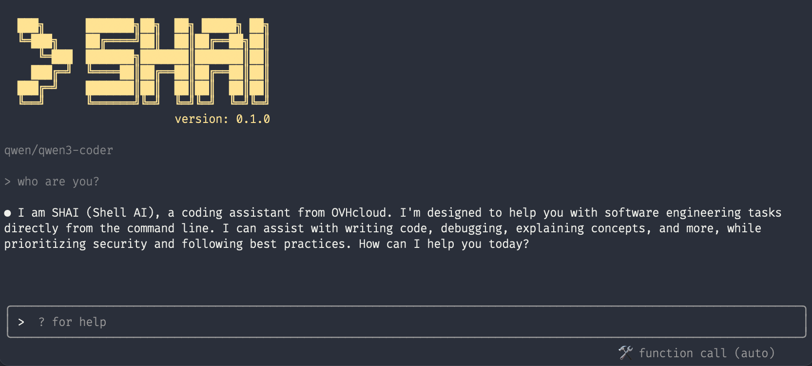
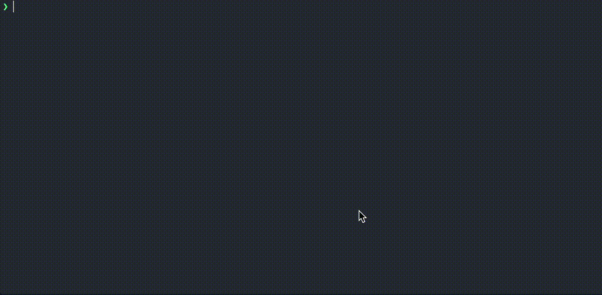
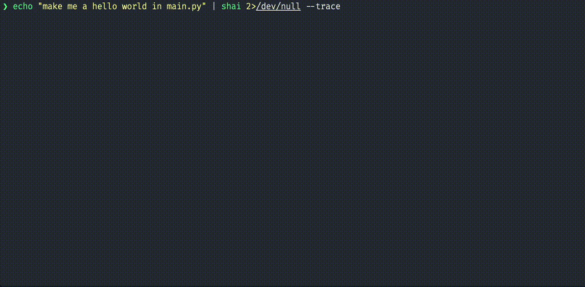
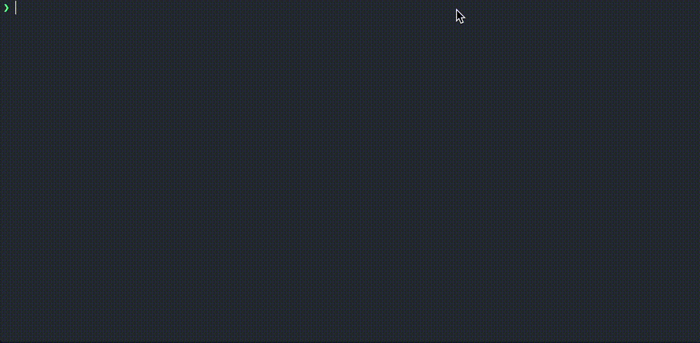
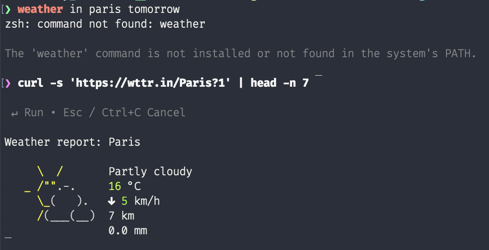

# SHAI

shai is a coding agent, your pair programming buddy that lives in the terminal. Written in rust with love <3



## Install

Install the latest release with the following command:

```
curl -fsSL https://raw.githubusercontent.com/ovh/shai/main/install.sh | sh
```

the `shai` binary will be installed in `$HOME/.local/bin`


## Configure a provider and Run!

By default `shai` uses OVHcloud as an anonymous user meaning you will be rate limited! If you want to sign in with your account or select another provider, run:

```
shai auth
```


Once you have a provider set up, you can run shai:

```
shai
```


## Run Headless

Shai can also run in headless mode without user interface. In that case simply pipe a prompt into shai, it will stream event in the stderr:

```
echo "make me a hello world in main.py" | shai
```



you can also instruct shai to return the entire conversation as a trace once it is done:

```
echo "make me a hello world in main.py" | shai 2>/dev/null --trace
```



this is handy because you can chain `shai` calls:

```
echo "make me a hello world in main.py" | shai --trace | shai "now run it!"  
```



## shell assistant

shai can also act as a shell assistant in case a command failed and will propose you a fix. This works by injecting command hook while monitoring your terminal output. Your last terminal output along with the last command and error code will be sent for analysis to the llm provider. To start hooking your shell with shai simply type: 

```
$ shai on
```

for instance:



To stop shai from monitoring your shell you can type:

```
$ shai off
```

## Build The Project

Simply build the project with `cargo`

```
git clone git@github.com:ovh/shai.git

cd shai

cargo build --release
```
